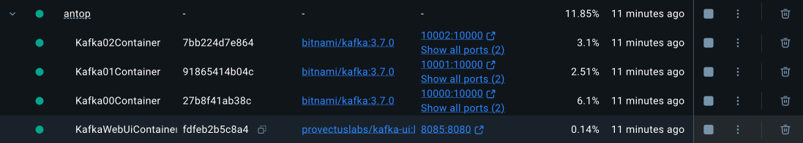
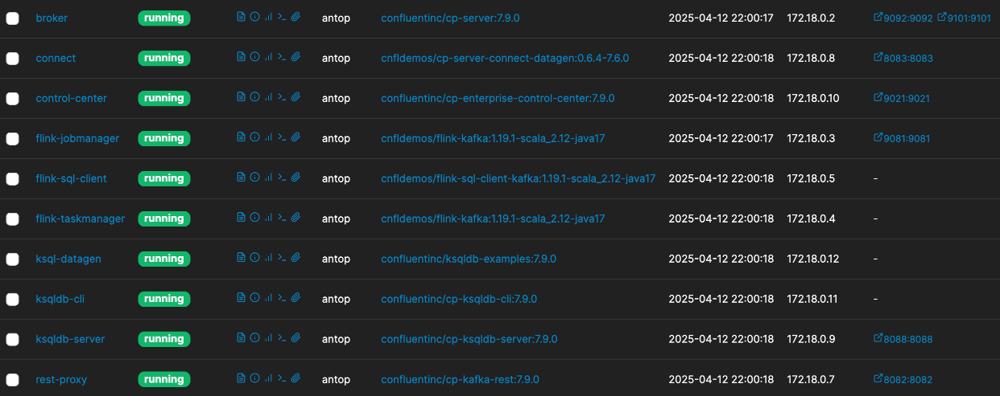

# 2. 카프카 환경 구성

## 카프카 설치

### Kafka 4.0 설치

카프카 설치 (각가 옵션 뭔지 모름 -_-/)

```
docker run -d --name kafka-local -p 9092:9092 apache/kafka:latest
```

토픽<sup>`Topic`</sup> 생성

```
/opt/kafka/bin/kafka-topics.sh --bootstrap-server localhost:9092 --create --topic peter-overview01
```

컨슈머<sup>`Consumer`</sup> 실행

```
/opt/kafka/bin/kafka-console-consumer.sh --bootstrap-server localhost:9092 --topic peter-overview01
```

프로듀서<sup>`Producer`</sup> 실행

```
/opt/kafka/bin/kafka-console-producer.sh --bootstrap-server localhost:9092 --topic peter-overview01
```

### 카프카 3.7.0 (Kraft) 클러스터로 설치하기

https://curiousjinan.tistory.com/entry/kafka-docker-kraft

kafka 3.7.0 과 kafak-ui 를 함께 도커에 설치하는 방법이다.



### Confluent Platform 설치

https://docs.confluent.io/platform/current/get-started/platform-quickstart.html

Confluent Platform 전체를 설치하는 방법이다.



## 메시지 보내고 받기

[Spring for Apache Kafka - Sample 1](https://github.com/spring-projects/spring-kafka/tree/main/samples/sample-01) 참조하여 프로듀서/컨슈머 개발
