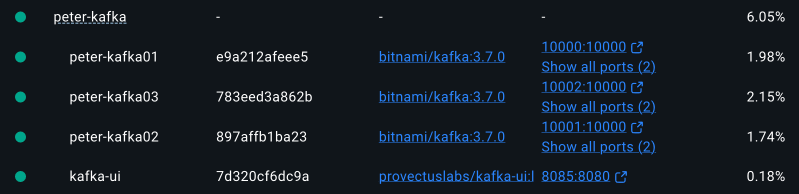
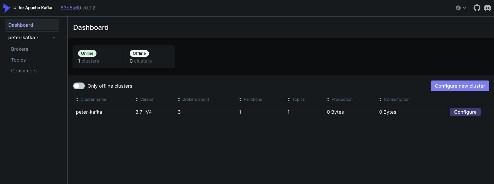

# 2. 카프카 환경 구성

## 카프카 설치

이 책에 맞춰서 하려면 브로커를 3개 설치해야 한다. [이 블로그](https://curiousjinan.tistory.com/entry/kafka-docker-kraft)에서 제공해준 컴포츠 파일을 약간 수정했다.

`peter-kafka/docker-compose.yml` 파일을 사용한다.

```
~/peter-kafka> docker-compose up -d
```

상위 컨테이너 명은 `docker-compose.yml` 파일이 있는 디렉토리명이 된다.



브라우저로 http://localhost:8085 접속해보면 Kafka UI 사이트를 사용할 수 있다.



브로커 포트는 `10000`이다.

## 기타 카프카 설치

이 외에 시도 했던 다른 카프카들 설치

### Kafka 4.0 설치

```
docker run -d --name kafka-local -p 9092:9092 apache/kafka:latest
```

### 카프카 3.7.0 (Kraft) 클러스터로 설치하기

https://curiousjinan.tistory.com/entry/kafka-docker-kraft

kafka 3.7.0 과 kafak-ui 를 함께 도커에 설치하는 방법이다.


### Confluent Platform 설치

https://docs.confluent.io/platform/current/get-started/platform-quickstart.html

Confluent Platform 전체를 설치하는 방법이다.


## 메시지 보내고 받기

[Spring for Apache Kafka - Sample 1](https://github.com/spring-projects/spring-kafka/tree/main/samples/sample-01) 참조하여 프로듀서/컨슈머 개발
