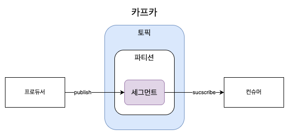
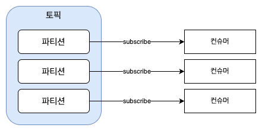
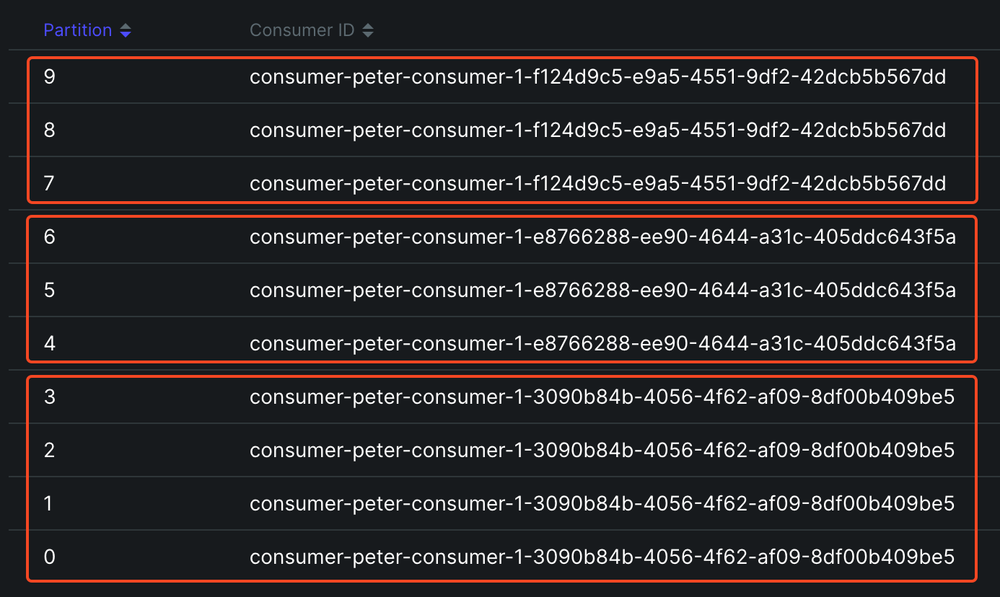
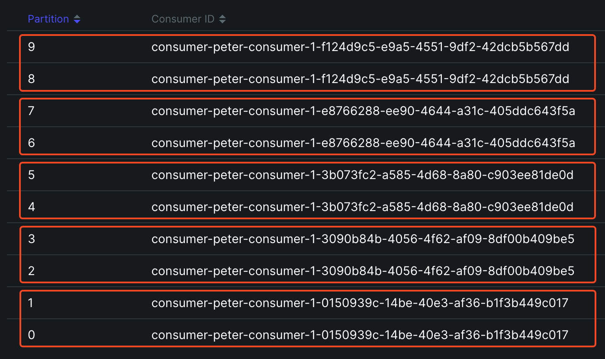
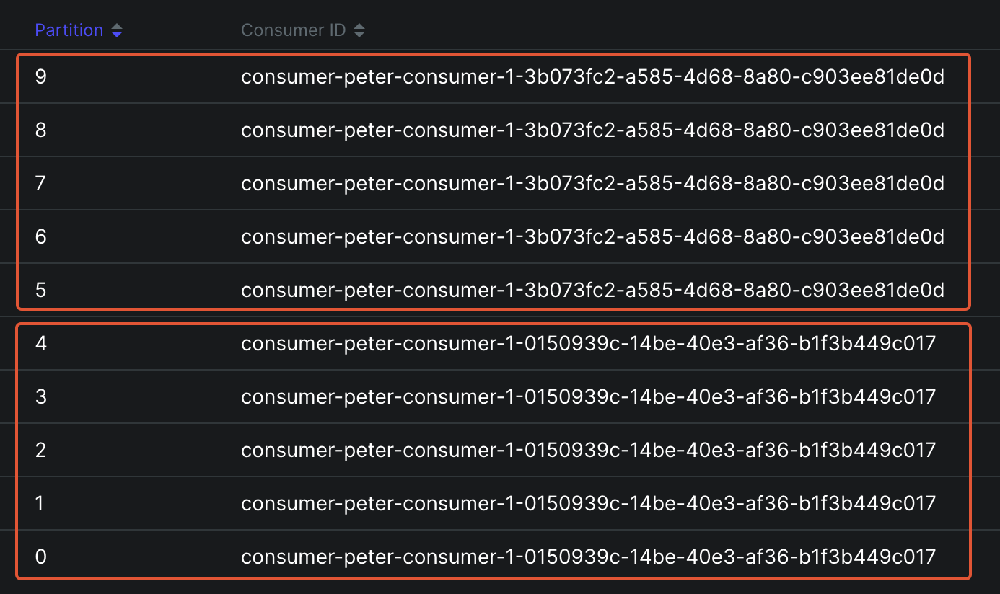

# 3. 카프카 기본 개념과 구조

## 토픽 ⊃ 파티션 ⊃ 세그먼트



### 토픽<sup>`Topic`</sup>

카프카는 메시지 피드들을 토픽으로 구분한다. 토픽은 데이터가 저장되는 공간이며, 데이터베이스의 테이블과 유사하다고 생각하면 된다. 각 토픽의 이름은 카프카 내에서 고유하다.

### 파티션<sup>`Partition`</sup>

병렬 처리 및 성능 향상을 위해 하나의 토픽을 여러 개로 나눈 것을 의미한다. 토픽을 여러 파티션으로 나누면 분산 처리가 가능하며, 나뉜 파티션 수만큼 컨슈머를 연결할 수도 있다.

### 세그먼트<sup>`Segment`</sup> (로그 세그먼트<sup>`log segment`</sup>)

세그먼트(로그 세그먼트)는 파티션에서 확장된 개념으로, 프로듀서가 전송한 실제 **메시지가 브로커의 로컬 디스크에 저장되는 파일**을 말한다. 로그 세그먼트에는 단순히 메시지(밸류)만 저장되는 것이 아니라, 메시지의 키, 오프셋, 크기에 대한 정보도 함께 저장된다.

## 컨슈머 그룹

컨슈머는 컨슈머 그룹 안에 속한 것이 일반적인 구조하나의 컨슈머 그룹 안에 여러 개의 컨슈머가 구성될 수 있음. **토픽의 파티션과 일대일로 매핑**되어 메시지를 가져옴



### 파티션 수와 컨슈머 수가 불일치할 때

토픽(파티션)에 붙는 컨슈머의 개수가 조정되면 리밸런싱<sup>`rebalancing`</sup>이 일어난다.

파티션 10 : 3 컨슈머



파티션 10 : 3 컨슈머 + 2 컨슈어 추가

```
[Consumer clientId=consumer-peter-consumer-1, groupId=peter-consumer] Request joining group due to: group is already rebalancing
[Consumer clientId=consumer-peter-consumer-1, groupId=peter-consumer] Revoke previously assigned partitions peter-basic01-8, peter-basic01-9
[Consumer clientId=consumer-peter-consumer-1, groupId=peter-consumer] (Re-)joining group
[Consumer clientId=consumer-peter-consumer-1, groupId=peter-consumer] Successfully joined group with generation Generation{generationId=35, memberId='consumer-peter-consumer-1-f124d9c5-e9a5-4551-9df2-42dcb5b567dd', protocol='range'}
[Consumer clientId=consumer-peter-consumer-1, groupId=peter-consumer] Finished assignment for group at generation 35: {consumer-peter-consumer-1-3090b84b-4056-4f62-af09-8df00b409be5=Assignment(partitions=[peter-basic01-2, peter-basic01-3]), consumer-peter-consumer-1-0150939c-14be-40e3-af36-b1f3b449c017=Assignment(partitions=[peter-basic01-0, peter-basic01-1]), consumer-peter-consumer-1-f124d9c5-e9a5-4551-9df2-42dcb5b567dd=Assignment(partitions=[peter-basic01-8, peter-basic01-9]), consumer-peter-consumer-1-3b073fc2-a585-4d68-8a80-c903ee81de0d=Assignment(partitions=[peter-basic01-4, peter-basic01-5]), consumer-peter-consumer-1-e8766288-ee90-4644-a31c-405ddc643f5a=Assignment(partitions=[peter-basic01-6, peter-basic01-7])}
[Consumer clientId=consumer-peter-consumer-1, groupId=peter-consumer] Successfully synced group in generation Generation{generationId=35, memberId='consumer-peter-consumer-1-f124d9c5-e9a5-4551-9df2-42dcb5b567dd', protocol='range'}
[Consumer clientId=consumer-peter-consumer-1, groupId=peter-consumer] Notifying assignor about the new Assignment(partitions=[peter-basic01-8, peter-basic01-9])
[Consumer clientId=consumer-peter-consumer-1, groupId=peter-consumer] Adding newly assigned partitions: peter-basic01-8, peter-basic01-9
Setting offset for partition peter-basic01-9 to the committed offset FetchPosition{offset=0, offsetEpoch=Optional.empty, currentLeader=LeaderAndEpoch{leader=Optional[localhost:10001 (id: 1 rack: null isFenced: false)], epoch=0}}
Setting offset for partition peter-basic01-8 to the committed offset FetchPosition{offset=0, offsetEpoch=Optional.empty, currentLeader=LeaderAndEpoch{leader=Optional[localhost:10001 (id: 1 rack: null isFenced: false)], epoch=0}}
```



컨슈머 3개 강제 종료. 바로 리벨런싱 되지는 않고 시간이 조금 지나고 리밸런싱 됨

```
[Consumer clientId=consumer-peter-consumer-1, groupId=peter-consumer] Request joining group due to: group is already rebalancing
[Consumer clientId=consumer-peter-consumer-1, groupId=peter-consumer] Revoke previously assigned partitions peter-basic01-0, peter-basic01-1
[Consumer clientId=consumer-peter-consumer-1, groupId=peter-consumer] (Re-)joining group
[Consumer clientId=consumer-peter-consumer-1, groupId=peter-consumer] Successfully joined group with generation Generation{generationId=36, memberId='consumer-peter-consumer-1-0150939c-14be-40e3-af36-b1f3b449c017', protocol='range'}
[Consumer clientId=consumer-peter-consumer-1, groupId=peter-consumer] Successfully synced group in generation Generation{generationId=36, memberId='consumer-peter-consumer-1-0150939c-14be-40e3-af36-b1f3b449c017', protocol='range'}
[Consumer clientId=consumer-peter-consumer-1, groupId=peter-consumer] Notifying assignor about the new Assignment(partitions=[peter-basic01-0, peter-basic01-1, peter-basic01-2, peter-basic01-3, peter-basic01-4])
[Consumer clientId=consumer-peter-consumer-1, groupId=peter-consumer] Adding newly assigned partitions: peter-basic01-0, peter-basic01-1, peter-basic01-2, peter-basic01-3, peter-basic01-4
Setting offset for partition peter-basic01-4 to the committed offset FetchPosition{offset=0, offsetEpoch=Optional.empty, currentLeader=LeaderAndEpoch{leader=Optional[localhost:10001 (id: 1 rack: null isFenced: false)], epoch=0}}
Setting offset for partition peter-basic01-3 to the committed offset FetchPosition{offset=0, offsetEpoch=Optional.empty, currentLeader=LeaderAndEpoch{leader=Optional[localhost:10002 (id: 2 rack: null isFenced: false)], epoch=0}}
Setting offset for partition peter-basic01-2 to the committed offset FetchPosition{offset=0, offsetEpoch=Optional.empty, currentLeader=LeaderAndEpoch{leader=Optional[localhost:10000 (id: 0 rack: null isFenced: false)], epoch=0}}
Setting offset for partition peter-basic01-1 to the committed offset FetchPosition{offset=0, offsetEpoch=Optional.empty, currentLeader=LeaderAndEpoch{leader=Optional[localhost:10002 (id: 2 rack: null isFenced: false)], epoch=0}}
Setting offset for partition peter-basic01-0 to the committed offset FetchPosition{offset=0, offsetEpoch=Optional.empty, currentLeader=LeaderAndEpoch{leader=Optional[localhost:10001 (id: 1 rack: null isFenced: false)], epoch=0}}
```



컨슈머가 갑자기 종료되면?

| 상황                  | 메시지 손실 여부              |
|---------------------|------------------------|
| 컨슈머가 죽었지만 오프셋 커밋 이전 | ❌ 손실 없음 (중복 소비 가능)     |
| 컨슈머가 죽기 전에 오프셋 커밋함  | ✅ 손실 가능 (메시지 처리 실패 시)  |
| 컨슈머 장애 후 리밸런싱 발생    | ❌ 손실 없음 (다른 컨슈머가 이어받음) | 