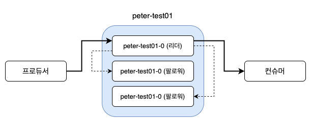
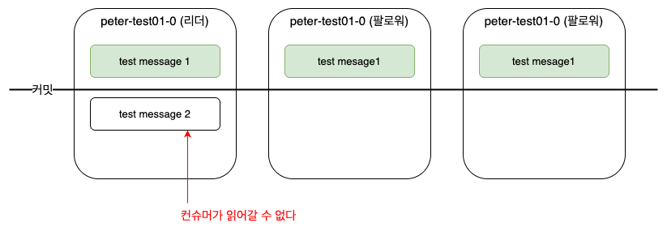
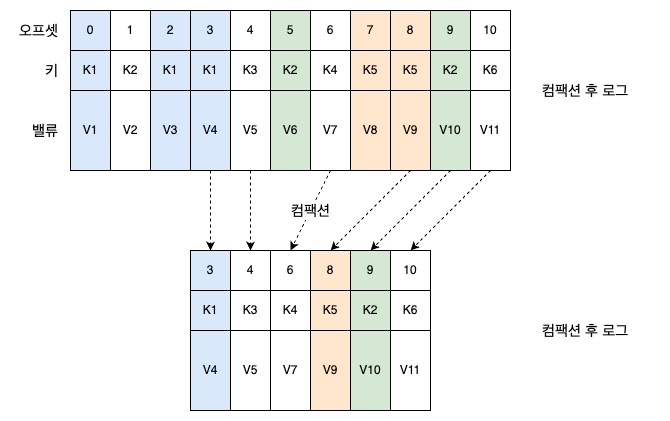

# 4. 카프카의 내부 동작 원리와 구현

## 카프카 리플리케이션

실제로 리플리케이션되는 것은 토픽`Topic`이 아니라 토픽을 구성하는 각각의 파티션`Partition`들이다. 

N개의 리플리케이션이 있는 경우 N-1까지의 브로커 장애가 발생해도 메시지 손실 없이 안정적으로 메시지를 주고받을 수 있다.

동일한 리플리케이션들은 리더와 팔로워로 구분하고, 각자의 역할을 분담시킨다.
* 리더 : 리플리케이션 중 하나가 선정되며, 모든 읽기(컨슈머)와 쓰기(프로듀서)는 그 리더를 통해서만 가능
* 팔로워 : 리더와 메시지 동기화 및 리더가 될 준비

리더와 팔로워는 SR`InSyncReplica`이라는 노리적 그룹으로 묵여 있고, ISR 그룹에 속하지 못한 팔로워는 새로운 리더의 자격을 가질 수 없다.

리더는 팔로워가 리플리케이션 동작을 잘 수행하고 있는지 판단하고 만약 팔로워가 특정 주기의 시간만큼 복제 요청을 하지 않느다면, ISR 그룹에서 추방한다.

ISR 내에서 모든 팔로워의 복제가 완료되면 리더는 내부적으로 커밋되었다는 표시를 한다. 마지막 커밋 오프셋 위치는 하이워터마크`high water mark`라고 부른다. **커밋된 메시지만 컨슈머가 읽어갈 수 있다**.

리더와 팔로워들의 리플리케이션 동작 방식은 리더가 푸시`push`하는 방식이 아니라 팔로워들이 풀`pull`하는 방식으로 동작하며, 리더는 팔로워들이 보내는 리플리케이션 요청의 오프셋을 보고, 팔로워들이 어느 취이의 오프셋까지 리플리케이션을 성공했는지를 인지한다.

리더에포크`LeaderEpoch`는 카프카의 파티션들이 다양한 장애 상황에서 복구 동작을 할 때 일관성을 유지하기 위한 용도로 이용횐다. 

## 컨트롤러

https://developer.confluent.io/courses/architecture/control-plane/

## 로그 (로그 세그먼트)

카프카 토픽으로 들어오는 메시지(레코드)는 세그먼트`segment`(로그 세그먼트`log segment`)라는 파일에 저장되낟.

로그 세그먼트의 최대 크기는 1GB가 기본값으로 설정되고, 로그 세그먼트기 1GB보다 커지는 경우에는 기본적으로 롤링`rolling` 전략을 적용한다.

로그 세그먼트 파일이 무한히 늘어날 경우를 대비해 로그에 대한 관리 계획을 수립해해야 한다. 크게 삭제와 컴패션`compaction`으로 구분할 수 있다.

삭제는 기본값으로 적용되며, 일정시간(기본값 7일)이 지난 모든 세그먼트 파일은 전부 삭제된다.

컴팩션(압축)은 키를 기준으로 **가장 마지막 메시지만 저장**하기 장애 복구가 빠르다. 키값을 기준으로 최종값만 필요한 워크로드에 적용하는 것이 바람직하다.

https://kafka.apache.org/documentation/#compaction

