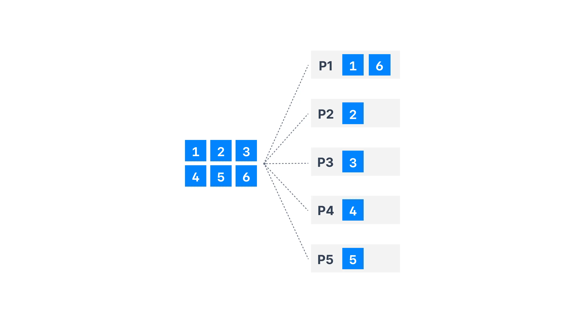

# 5. 프로듀서의 내부 동작 원리와 구현

* https://learn.conduktor.io/kafka/producer-default-partitioner-and-sticky-partitioner/
* https://docs.confluent.io/platform/current/installation/configuration/producer-configs.html

## 파티셔너

프로듀서가 어느 파티션으로 메시지를 보내야 할지를 결정할 때 사용하는 것이 파티셔너`partitioner`다.

파티션을 결정하는 알고리즘은 기본적으로 메시지의 키를 해시`hash` 처리해 파티션을 구한다.

메시지의 키값이 동일하면 해당 메시지들은 모두 같은 파티션으로 전송된다.

파티션 수가 변경되면 메시지의 키와 매핑된 해시 테이블이 변경되어 다른 파티션으로 전송될 수있다.

* 라운드 로빈 전략 : 메시지의 키값이 `null`일 경우 기본값인 라운드 로빈`round-robin` 알고리즘을 사용해 랜덤하게 파티션들로 전송한다. 배치 처리를 위해 잠시 메시지들이 대기하는
  과정에서 라운드 로빈 전략은 호율을 떨어뜨릴 수 있다.

  

* 스티키 파티셔닝 전략 : 하나의 파티션에 레코드 수를 먼저 채워서 카프카로 빠르게 배치 전송하는 전략이다. 파티셔너는 배치를 위한 레코드 수에 도달할 때까지 다른 파티션으로 보내지 않고, 동일한 파티션으로
  메시지를 담아놓는다.

    

## 프로듀서의 배치

프로듀서는 배치 전송을 위해 [
`buffer.memory`](https://docs.confluent.io/platform/current/installation/configuration/producer-configs.html#buffer-memory), [
`batch.size`](https://docs.confluent.io/platform/current/installation/configuration/producer-configs.html#batch-size), [
`linger.ms`](https://docs.confluent.io/platform/current/installation/configuration/producer-configs.html#linger-ms) 옵션들을
제공한다.

카프카를 사용하는 목적에 따라 처리량을 높일지, 아니면 지연 없는 전송을 해야 할지 선택을 해야 한다.

`buffer.memory >= batch.size * n`

## 중복 없는 전송

| 전송 방식                               | 손실 | 중복 |
|-------------------------------------|:--:|:--:|
| 적어도 한번 전송`at-least-once` | X  | O  |
| 최대 한 번 전송`most-once`     | O  | X  |
| 중복 없는 전송                            | X  | X  |

카프카는 사용자들의 개발 편의를 높이기 위해 종복 없이 전송할 수 있는 기능을 제공한다.

정확히 한번 전송 방식`exactly-once`의 프로듀서는 적어도 한번 전송 과정과 동일하지만 브로커에서 메시지를 중복 저장하지 않고 `ACK`만 보낸다.

프로듀서와 브로커가 기록되는 메시지들에 대해 각각 시퀀스 번호를 가지고 있고, 프로듀서가 보낸 메시지의 시퀀스 번호가 브로커가 갖고 있는 시퀀스 번호보다 정확하게 하나 큰 경우가 아니라면, 브로커는 프로듀서의 메시지를 저장하지 않는다.

[컨플루언트 블로그 글](https://www.confluent.io/blog/exactly-once-semantics-are-possible-heres-how-apache-kafka-does-it/)에 따르면, 중복 없는 전송을 적용한 후 기존 대비 최대 약 20% 정도도 성능이 감소한다고 한다.

## 정확히 한번 전송

정확히 한번 전송`exactly-once`

Spring Kafka는 `spring.kafka.producer.transaction-id-prefix` 설정만 하면 Spring Boot가 자동으로 `KafkaTransactionManager`빈을 구성하여 리스너 컨테이너에 연결한다.

https://docs.spring.io/spring-kafka/reference/kafka/transactions.html
