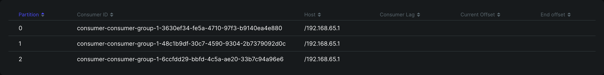
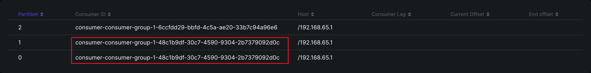
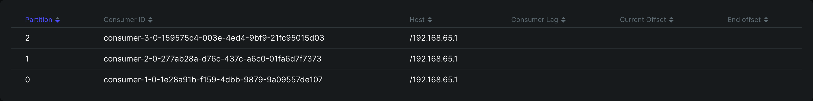
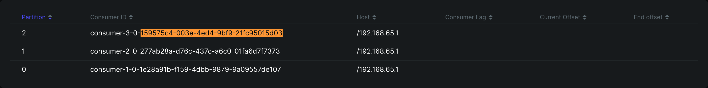
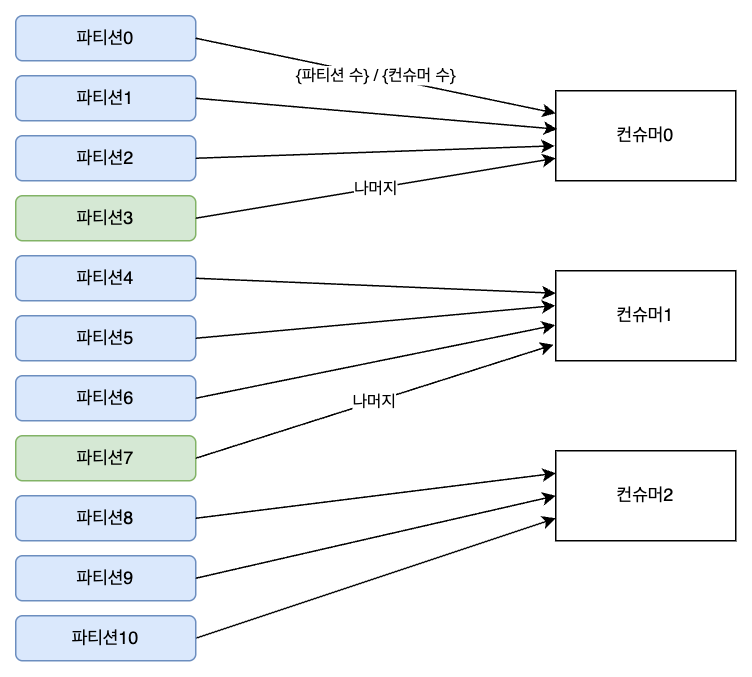
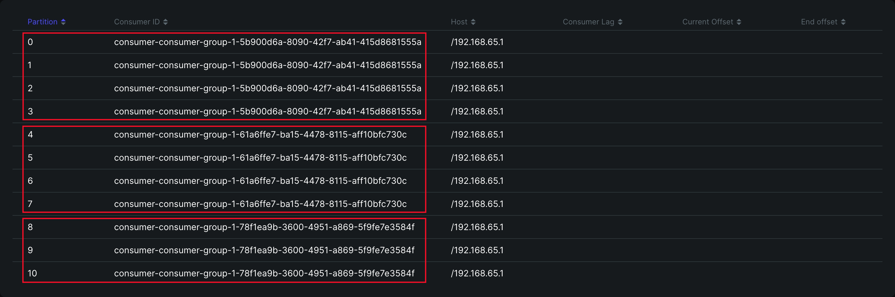
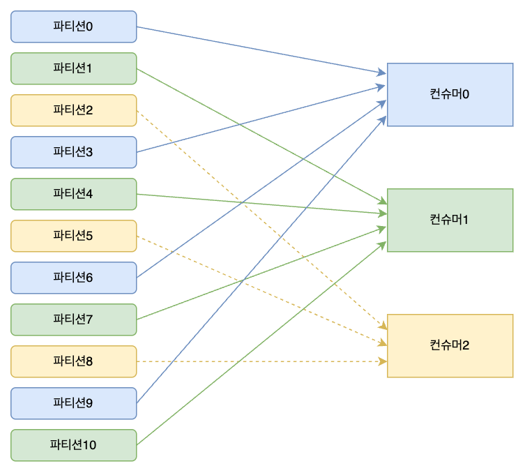
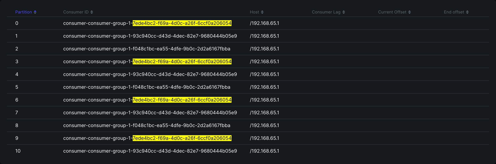
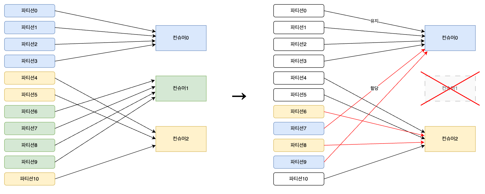

# 6. 컨슈머의 내부 동작 원리와 구현

* https://www.confluent.io/blog/incremental-cooperative-rebalancing-in-kafka/
* https://yeongchan1228.tistory.com/60

## 컨슈머 오프셋 관리

컨슈머의 동작 중 가장 핵심은 메시지의 위치를 나타내는 오프셋<sup>offset</sup> 관리다.

한 컨슈머가 멈추고 새로운 컨슈머가 기존 컨슈머의 역할을 할 때 오프셋으로부터 새로우 메시지를 수신한다.

오프셋 값은 컨슈머가 다음으로 읽어야 할 위치를 말하고, `__consumer_offsets` 토픽에 기록된다. 내부 토픽이지만 파티션 수(`offsets.topic.num.partitaions`)와 리플리케이션 팩터 수(`offsets.topic.replication.factor`)를 설정할 수 있다.

## 그룹 코디네이터

컨슈머 그룹에서 각 컨슈머들에게 작업을 균등하게 분해하는 독작을 컨슈머 리밸런싱<sup>`consumer rebalancing`</sup>이라고 부른다.

컨슈머 그룹 관리를 컨슈머 그룹이 구독한 토픽의 파티션들과 그룹의 맴버들을 트래킹<sup>`tracking`</sup>하는 코디네이터가 브로커에 존재한다.

컨슈머 그룹의 변화들은 코디네이터에게 컨슈머가 `join` 또는 `leave` 요청을 보냄으로써 자연스럽게 처리된다.

그룹 코디네이터와 컨슈머들은 서로 하트비트<sup>`heartbeat`</sup>를 주고 받으며, 컨슈머가 장애로 leave 요청을 보내지 못하고 종료되는 경우 대응한다.

* 파티션 3 : 컨슈머 3

    

* 파티션 3 : 컨슈머 2

    


> 컨슈머 리밸런싱 동작 과정 중 일시적으로 모든 컨슈머가 일시 중기하게 되는데, 경우에 따라 매우 높은 비용이 지출되므로 가급적 리밸런싱이 자주 발생하지 않도록 주의해야 한다.

## 스태틱 멤버십

컨슈머를 시작할 때 `group.instance.id` 값을 설정하면 컨슈머가 종료되도 `session.timeout.ms`에 설정된 시간 안에 다시 연결된다면 리밸런싱을 하지 않는다.

* 파티션 3 : 3 컨슈머
    
    

* 파티션 3 : 2 컨슈머 - `session.timeout.ms` 시간 안에는 리밸런싱하지 않는다.

    

## 컨슈머 파티션 할당 전략

컨슈머의 리더가 정해진 파티션 할당 전략에 따라 각 컨슈머와 대상 토픽의 파티션을 매칭시킨다.

| 전략                        | 이름                | 설명                                                                  |
|---------------------------|-------------------|---------------------------------------------------------------------|
| RangeAssignor             | 레인지 파티션 할당 전략     | 파티션 할당 전략의 기본값으로서 토픽별로 할당 전략을 사용함. 동일한 키를 이용하는 2개 이상의 토픽을 컨슘할 때 유용함 |
| RoundRobinAssignor        | 라운드 로빈 파티현 할당 전략  | 사용 가능한 파티션과 컨슈머들을 라운드 로빈으로 할당함. 균등한 분배 가능                           |
| StickyAssignor            | 스티키 파티션 할당 전략     | 컨슈머가 컨슘하고 있는 파티션을 계속 유지할 수 있음                                       |
| CooperativeStickyAssignor | 협력적 스티키 파티션 할당 전략 | 스티키 방식과 유사하지만, 전체 일시 정지가 아닌 연속적인 재조정 방식                             |


### 레인지 파티션 할당 전략

`파티션수 / 컨슈머수` 만큼 컨슈머에 할당하고 나머지(`파티션수 % 컨슈머수`) 파티션은 **앞쪽의 컨슈머들이 추가로 할당받게 된다**.





### 라운드 로빈 파티현 할당 전략

파티션과 컨슈머를 균등하게 매핑한다.





### 스티키 파티션 할당 전략

가능한 한 균형 잡힌 파티션 할당과 재할당이 발생할 때 되도록 기존의 할당된 파티션 정보를 보장하는 것이 목표인 전략이다.

최초의 배치 전략은 라운드 로빈 할당 전략과 매우 흡사하다. (레인지와 라운드 로빈 짬뽕?)

컨슈가 제외 되었을 때 이미 할당된 파티션은 유지되어 있고, 컨슈머가 할당되지 않은 파티션들에 대해서만 할당한다.



> 스태틱 멤버십의 기능을 통해 불필요한 리밸런싱 동작이 일어나지 않게 할 수는 있지만, 불가피하게 리밸런싱이 일어나면 여진히 컨슈머의 다운타임은 발생한다.

### 협력적 스티키 파티션 할당 전략

결과적으로 본다면 스티키 전략과 동일하지만 컨슈머 그룹 내부의 리밸런싱 동작이 한층 더 고도화 되었다.

기존의 리밸런싱 동작은 한 번에 모든 파티션 할당 작업이 끝난다는 장점이 있지만, 전체 컨슈머가 일시적으로 멈춘 상태에서 리밸런싱이 이뤄진다는 제약이 있다.

협력적 스티키 할당 전략에서는 되도록 동작 중인 컨슈머들에게 영향을 주지 않는 상태에서 몇 차례에 걸쳐 리밸런싱이 이뤄진다.

## 정확히 한번 컨슈머 동작

격리 수준(Isolation Level) 설정만 추가하면 트랜잭션 컨슈머로 동작한다.

한 건의 메시지를 전송 했는데 오프셋이 2로 표시된다. 오프셋이 하나 더 추가된 이유는 트랜잭션의 종료를 표시하기 위해 메시지 전송 후 커밋 또는 중단에 대한 표시를 남기는 트랜잭션 메시지가 추가되기 때문이다.

> 프로듀서도 트랜잭션 모드로 동작해야 된다.

* [ExactlyOnceProducer.kt](src/main/kotlin/org/antop/kafka/ExactlyOnceProducer.kt)
* [ExactlyOnceConsumer.kt](src/main/kotlin/org/antop/kafka/ExactlyOnceConsumer.kt)

```
Topic: peter-test06, Partition: 0, Offset: 2, Key: null, Received Message: Hello World!
Topic: peter-test06, Partition: 0, Offset: 4, Key: null, Received Message: Hello World!
Topic: peter-test06, Partition: 0, Offset: 6, Key: null, Received Message: Hello World!
Topic: peter-test06, Partition: 1, Offset: 0, Key: null, Received Message: Hello World!
Topic: peter-test06, Partition: 0, Offset: 8, Key: null, Received Message: Hello World!
Topic: peter-test06, Partition: 0, Offset: 10, Key: null, Received Message: Hello World!
```

컨슈머는 트랜잭션 코디네이터와 통신하는 부분이 없으므로 정확하게 메시지를 한 번 가져오는지는 보장할 수 없다.
