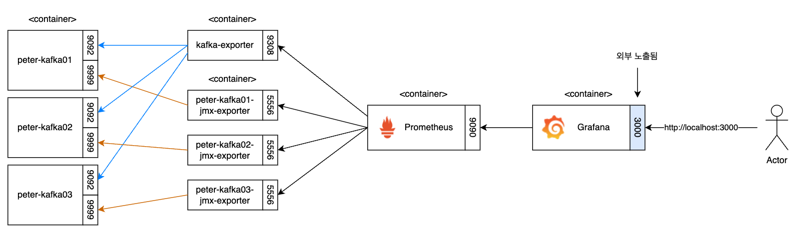
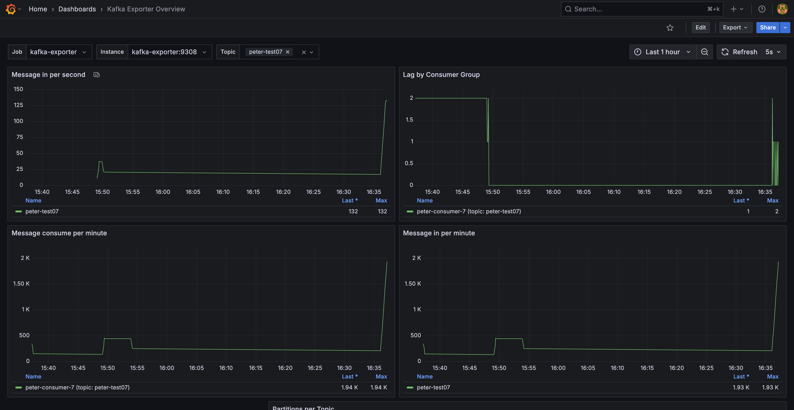
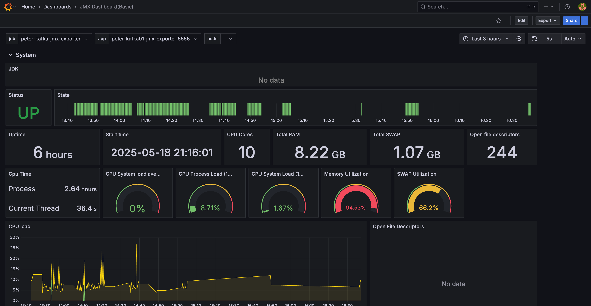

# 7. 카프카 운영과 모니터링

카프카를 도커 기반으로 띄우게 되면서 모니터링을 하기 위해 다른 컨테이너들도 띄워야 했다.

`bitnami/kafka` 이미지에서 `-Dcom.sun.management.jmxremote -Dcom.sun.management.jmxremote.authenticate=false -Dcom.sun.management.jmxremote.ssl=false` 설정은 기본적으로 올라가지만 포트 오픈은 되어 있지 않아서 설정에 추가했다.

```yaml
    environment:
      - ...
      # JMX
      - KAFKA_OPTS=-Dcom.sun.management.jmxremote.port=9999
          -Dcom.sun.management.jmxremote.rmi.port=9999
          -Dcom.sun.management.jmxremote.local.only=false
          -Djava.rmi.server.hostname=peter-kafka01
```



Grafana 대시보드는 [Kafka Exporter Overview](https://grafana.com/grafana/dashboards/7589-kafka-exporter-overview/), [JMX Dashboard(Basic)](https://grafana.com/grafana/dashboards/14845-jmx-dashboard-basic/)를 사용했다.

Kafka Exporter Overview



JMX Dashboard(Basic)


