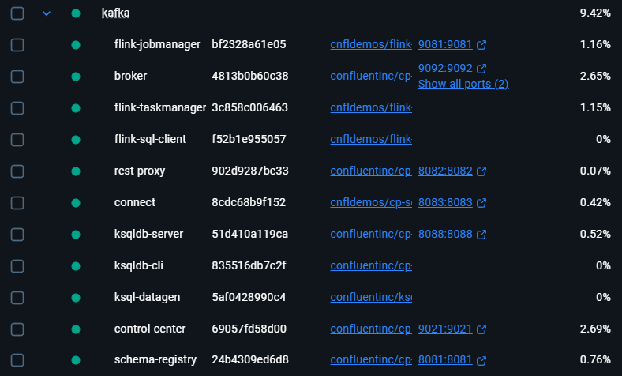

# 10. 스키마 레지스트리

* https://docs.confluent.io/platform/current/schema-registry/fundamentals/serdes-develop/serdes-avro.html

## 카프카 설치

카프카는 [Confluent Platform](https://docs.confluent.io/platform/current/get-started/platform-quickstart.html)에서 제공하는 도커를 사용했다.



`schema.compatibility.level` 값은 `docker-compose.yml`에서 설정했다.

```yaml
  schema-registry:
    image: confluentinc/cp-schema-registry:7.9.1
    hostname: schema-registry
    container_name: schema-registry
    depends_on:
      - broker
    ports:
      - "8081:8081"
    environment:
      SCHEMA_REGISTRY_HOST_NAME: schema-registry
      SCHEMA_REGISTRY_KAFKASTORE_BOOTSTRAP_SERVERS: 'broker:29092'
      SCHEMA_REGISTRY_LISTENERS: http://0.0.0.0:8081
      SCHEMA_REGISTRY_SCHEMA_COMPATIBILITY_LEVEL: 'FULL' # 여기
```

| 설정값                 | 설명                              |
|:--------------------|:--------------------------------|
| NONE                | 호환성 검사 없음                       |
| BACKWARD            | 이전 버전과의 하위 호환성 검사               |
| BACKWARD_TRANSITIVE | 모든 이전 버전과의 하위 호환성 검사            |
| FORWARD             | 다음 버전과의 상위 호환성 검사               |
| FORWARD_TRANSITIVE  | 모든 다음 버전과의 상위 호환성 검사            |
| FULL                | 양방향 호환성 검사 (BACKWARD + FORWARD) |
| FULL_TRANSITIVE     | 모든 버전과의 양방향 호환성 검사              |


## 실습 순서

책의 예제는 파이썬으로 되어 있는데 코틀린으로 작성해서 하다보니 컨슈머에서 스키마를 직접 읽어서 적용하는 방법을 못찾았다. (프로듀서에서는 스키마를 지정해서 전송 가능)

그래서 Avro 파일 기반으로 클래스를 생성해서 프로시저/컨슈머에서 사용했다.

책에 나온대로 테스트 하려면 순서가 중요하다.

1. `student1.avsc` 스키마 파일의 `name`을 `Student`로 하고 소스 생성
2. `AvroProducer` 실행
3. `AvroConsumer` 실행 (실행 상태 유지!!)
4. `student2.avsc` 스키마 파일의 `name`을 `Student`로 하고 소스 생성
5. `AvroProducer` 실행
6. 컨슈머에서 `{"first_name": null, "last_name": null, "class": 1}` 메세지 받는 걸 확인
