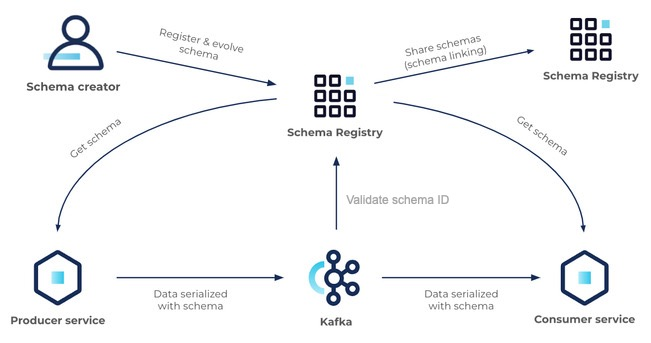

# 10. 스키마 레지스트리

* https://docs.confluent.io/platform/current/schema-registry/index.html
* https://docs.confluent.io/platform/current/schema-registry/fundamentals/serdes-develop/serdes-avro.html

## 스키마의 개념과 유용성

스키마<sup>`schema`</sup>란 정보를 구성하고 해석하는 것을 도와주는 프레임워크나 개념을 의한다.

사전에 정의하지 않은 형태의 데이터를 해당 토픽으로 보내면, 그와 연결된 모든 시스템이 영향을 받게 될 것이고 이는 매우 심각한 문제로 이어질 수 있다.

프로듀서 관리자는 카프카 토픽의 데이터를 컨슘하는 관리자에게 반드시 데이터 구조를 설명해야 한다.

운영 중 데이터의 스키마가 변경되어도 안전하게 메시지를 주고 받을 수 있도록 할 수 있다.

## 카프카와 스키마 레지스트리



카프카에서 스키마를 활용하는 방법은 스키마 레지스트리라는 별도의 애플리케이션을 이용한다.

* 프로듀서는 스키마 레지스트리에 등록된 스키마의 ID와 메시지를 카프카로 전송
* 컨슈머는 스키마 ID를 스키마 레지스트리로부터 읽어온 후 프로듀서가 전송한 스키마 ID와 메시지를 조합해서 읽는다.

스키마 레지스트리가 지원하는 데이터 포맷

1. Apache Avro:
    - 가장 널리 사용되는 포맷
    - 컴팩트한 바이너리 포맷
    - 스키마 진화(Schema Evolution) 지원이 우수
    - 동적 타입 지원
    - 복잡한 데이터 구조 표현 가능

2. Protocol Buffers (Protobuf):
    - Google이 개발한 포맷
    - 매우 효율적인 바이너리 직렬화
    - 다양한 프로그래밍 언어 지원
    - 강력한 타입 시스템
    - IDL<sup>`Interface Definition Language`</sup> 제공

3. JSON Schema:
    - JSON 기반의 스키마 정의
    - 사람이 읽기 쉬운 포맷
    - 웹 기반 애플리케이션과의 호환성이 좋음
    - 유연한 스키마 정의 가능
    - 검증 및 문서화 기능 제공

각 포맷의 주요 특징 비교:

| 특징     | Avro  | Protobuf | JSON Schema |
|--------|-------|----------|-------------|
| 직렬화 성능 | 높음    | 매우 높음    | 상대적으로 낮음    |
| 데이터 크기 | 작음    | 매우 작음    | 큼           |
| 스키마 진화 | 매우 우수 | 좋음       | 제한적         |
| 개발 용이성 | 보통    | 보통       | 매우 쉬움       |
| 언어 지원  | 많음    | 매우 많음    | 거의 모든 언어    |

## 카프카 설치

카프카는 [Confluent Platform](https://docs.confluent.io/platform/current/get-started/platform-quickstart.html)에서 제공하는 도커를
사용했다.


`schema.compatibility.level` 값은 `docker-compose.yml`에서 설정했다.

```yaml
  schema-registry:
    image: confluentinc/cp-schema-registry:7.9.1
    hostname: schema-registry
    container_name: schema-registry
    depends_on:
      - broker
    ports:
      - "8081:8081"
    environment:
      SCHEMA_REGISTRY_HOST_NAME: schema-registry
      SCHEMA_REGISTRY_KAFKASTORE_BOOTSTRAP_SERVERS: 'broker:29092'
      SCHEMA_REGISTRY_LISTENERS: http://0.0.0.0:8081
      SCHEMA_REGISTRY_SCHEMA_COMPATIBILITY_LEVEL: 'FULL' # 여기
```

## 스키마 레지스트리 실습

책의 예제는 파이썬으로 되어 있는데 코틀린으로 작성해서 하다보니 컨슈머에서 스키마를 직접 읽어서 적용하는 방법을 못찾았다. (프로듀서에서는 스키마를 지정해서 전송 가능)

그래서 Avro 파일 기반으로 클래스를 생성해서 프로시저/컨슈머에서 사용했다.

책에 나온대로 테스트 하려면 순서가 중요하다.

| 순서 | 내용                                                       | 프로듀서 스키마 ID | 컨슈머 스키마 ID                        | 수신 메시지                                                                                                                                                    |
|----|----------------------------------------------------------|-------------|-----------------------------------|-----------------------------------------------------------------------------------------------------------------------------------------------------------|
| 1  | `studnet1.avsc` 스키마 파일의 `name`을 `Student`로 변경하고 자바 소스 생성 | -           | -                                 |                                                                                                                                                           |
| 2  | 프로시저 실행                                                  | 1           | -                                 |                                                                                                                                                           |
| 3  | 컨슈어 실행 (실행 유지)                                           | 1           | 1                                 | `{"name": "Peter", "class": 1}`                                                                                                                           |
| 4  | `student2.avsc` 스키마 파일의 `name`을 `Student`로 하고 소스 생성      | -           | 1                                 | -                                                                                                                                                         |
| 5  | 프로시저 실행                                                  | 2           | <span style="color:red;">1</span> | `{"name": null, "class": 1}`                                                                                                                              |
| 6  | 컨슈머 종료                                                   | 2           | -                                 |                                                                                                                                                           |
| 7  | `student2` 사용하는 다른 컨슈머 그룹으로 컨슈머 실행                       | 2           | 2                                 |                                                                                                                                                           |
| 8  | 프로시저 실행                                                  | 2           | 2                                 | `{"first_name": "Peter", "last_name": "Parker", "class":1}`                                                                                               |
| 9  | 다른 그룹을 컨슈머 실행                                            | 2           | 2                                 | `{"name": null, "class": 1}`<br>{"first_name": "Peter", "last_name": "Parker", "class":1}`<br>`{"first_name": "Peter", "last_name": "Parker", "class":1}` |

## 스키마 레지스트리 호환성

| 설정값                 | 설명                              |
|:--------------------|:--------------------------------|
| NONE                | 호환성 검사 없음                       |
| BACKWARD            | 이전 버전과의 하위 호환성 검사               |
| BACKWARD_TRANSITIVE | 모든 이전 버전과의 하위 호환성 검사            |
| FORWARD             | 다음 버전과의 상위 호환성 검사               |
| FORWARD_TRANSITIVE  | 모든 다음 버전과의 상위 호환성 검사            |
| FULL                | 양방향 호환성 검사 (BACKWARD + FORWARD) |
| FULL_TRANSITIVE     | 모든 버전과의 양방향 호환성 검사              |
